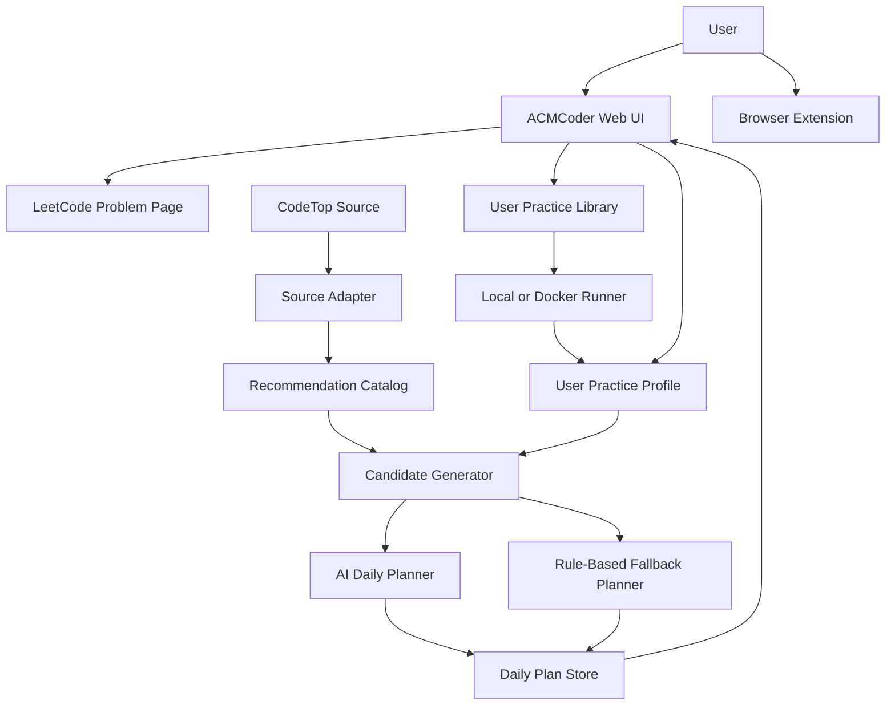
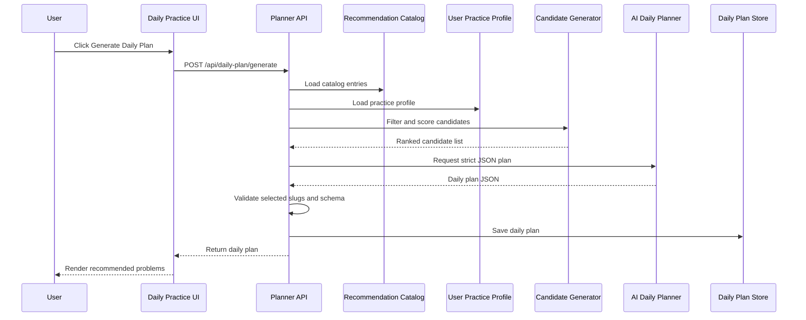
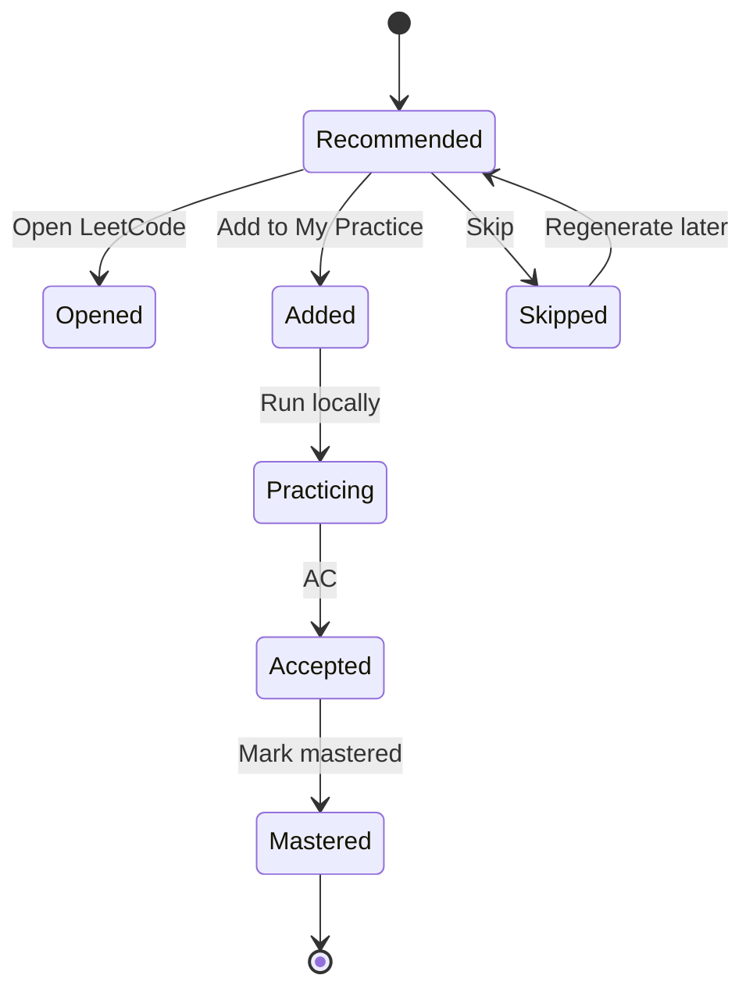

# ACMCoder Daily Planner Design

Date: 2026-07-09
Status: approved concept, pending implementation plan

## Context

ACMCoder is currently a local-first LeetCode ACM practice runner. The existing repository already contains a local Web UI, browser extension, seed problems, Java/C++/Python execution, local memory, AC progress, import/export, Docker runner, and OpenAI-compatible assist settings.

This design adds an AI-centered daily practice planner. The goal is not to replace LeetCode, generate new algorithm problems, or use an LLM as a judge. The goal is to help interview-preparation users decide what to practice each day from a stable high-frequency problem pool.

Attribution note: this spec separates "existing repository capability" from "planned project extension". It does not claim which parts came from an upstream original project because this local repository does not currently include an upstream source or fork baseline.

## Problem

Users preparing for algorithm interviews face too many candidate problems. High-frequency lists such as CodeTop are useful, but they are still static rankings. A user still needs to decide which tags to cover today, how hard the session should be, what to avoid repeating, and which problems should be opened or added into their own ACMCoder practice library.

The specific problem is:

> Given a stable external high-frequency problem catalog and a user's local practice state, generate a daily practice plan that balances frequency, topic coverage, difficulty, and repetition control.

## Goals

- Generate a daily plan from a local recommendation catalog in less than 3 seconds when the AI provider responds normally.
- Recommend 3 to 5 problems per daily plan.
- Cover at least 2 algorithm tags when the candidate pool allows it.
- Avoid recommending problems marked `mastered` or practiced in the last configurable cooldown window.
- Keep external recommendation catalog data separate from the user's own practice library.
- Provide deterministic rule-based fallback when AI is unavailable or returns invalid JSON.
- Preserve current ACMCoder behavior for running code, recording AC progress, and opening LeetCode pages.

## Non-Goals

- Do not generate brand-new algorithm problems in the MVP.
- Do not use AI as a judge.
- Do not classify detailed mistake types.
- Do not generate AI post-practice reviews.
- Do not require login, cloud sync, or multi-user accounts.
- Do not copy or distribute full LeetCode problem statements.
- Do not rely on live CodeTop scraping during daily plan generation.

## Recommended Approach

Use a three-layer design:

1. Recommendation Catalog: a local cache of CodeTop-style high-frequency problem metadata.
2. Candidate Generator: a deterministic rule layer that filters and ranks candidates.
3. AI Daily Planner: an LLM-based planner that selects a balanced daily set from allowed candidates and explains the plan.

The AI component is core because the product value is the daily plan composition. The runner remains responsible for code execution, and LeetCode remains the source for full problem statements.

## Architecture



## Component Responsibilities

### Recommendation Catalog

Stores external problem metadata from CodeTop or a compatible JSON import. It is not the user's own practice library.

Responsibilities:

- Persist external problem metadata.
- Track source name, rank, URL, tags, difficulty, and frequency score.
- Expose catalog entries for recommendation.
- Support import from JSON.
- Later support optional CodeTop sync without changing planner APIs.

It does not store full problem statements or user progress.

### User Practice Library

Uses the existing ACMCoder problem and memory model for problems the user actually practices.

Responsibilities:

- Store seed problems and user-added problems.
- Keep templates and sample cases where available.
- Allow a recommended problem to be added into the practice library.
- Preserve current import/export behavior.

### User Practice Profile

Builds a lightweight profile from existing progress plus planner-specific actions.

Tracked fields:

- `acceptedCount`
- `lastPracticedAt`
- `skippedAt`
- `masteredAt`
- `wantPracticeAgain`
- preferred target mode
- daily problem count
- difficulty pressure

This intentionally avoids mistake taxonomy and AI review history.

### Candidate Generator

Deterministically filters and scores catalog entries before AI sees them.

Responsibilities:

- Remove or penalize recently practiced problems.
- Remove or penalize mastered problems.
- Prefer high CodeTop frequency.
- Match tags and difficulty to the user's target mode.
- Ensure enough candidates are passed to the AI planner.
- Produce a ranked, bounded candidate list.

This layer reduces AI hallucination risk because the AI can only select from valid candidate IDs.

### AI Daily Planner

Receives the bounded candidate list and user profile summary. Returns a structured daily plan.

Responsibilities:

- Choose today's theme.
- Select 3 to 5 problems from allowed candidates.
- Balance tags and difficulty.
- Provide short recommendation reasons.
- Return strict JSON matching the contract.

It does not invent problem IDs, judge code, or fetch external websites.

### Rule-Based Fallback Planner

Creates a valid daily plan if the AI call fails.

Responsibilities:

- Select top-ranked candidates by deterministic score.
- Enforce simple tag diversity where possible.
- Return the same JSON shape as the AI planner.
- Mark the plan source as `fallback`.

### Daily Plan Store

Persists today's generated plan so the UI can reload it without regenerating.

Responsibilities:

- Store plans by date.
- Store plan source: `ai` or `fallback`.
- Store selected problem slugs, reasons, and actions.
- Avoid rewriting today's plan unless the user explicitly regenerates.

## Data Model

### Catalog Entry

```json
{
  "source": "codetop",
  "sourceRank": 12,
  "leetcodeSlug": "merge-k-sorted-lists",
  "title": "Merge k Sorted Lists",
  "leetcodeUrl": "https://leetcode.cn/problems/merge-k-sorted-lists/",
  "difficulty": "hard",
  "tags": ["linked-list", "heap", "divide-and-conquer"],
  "frequencyScore": 0.94,
  "lastSyncedAt": "2026-07-09T10:00:00+08:00"
}
```

### Practice Profile Item

```json
{
  "leetcodeSlug": "merge-k-sorted-lists",
  "acceptedCount": 1,
  "lastPracticedAt": "2026-07-07T20:10:00+08:00",
  "skippedAt": null,
  "masteredAt": null,
  "wantPracticeAgain": false
}
```

### Daily Plan

```json
{
  "date": "2026-07-09",
  "source": "ai",
  "theme": "Linked list and heap interview practice",
  "difficultyMix": {
    "easy": 1,
    "medium": 2,
    "hard": 1
  },
  "items": [
    {
      "leetcodeSlug": "merge-k-sorted-lists",
      "title": "Merge k Sorted Lists",
      "leetcodeUrl": "https://leetcode.cn/problems/merge-k-sorted-lists/",
      "difficulty": "hard",
      "tags": ["linked-list", "heap"],
      "focus": "heap",
      "reason": "High-frequency hard problem that connects linked-list merging with heap maintenance.",
      "estimatedMinutes": 35,
      "actions": {
        "opened": false,
        "addedToPractice": false,
        "skipped": false,
        "mastered": false
      }
    }
  ]
}
```

## Candidate Scoring

The rule layer computes a candidate score before calling AI:

```text
score =
  frequencyWeight
+ tagMatchWeight
+ difficultyMatchWeight
+ unseenWeight
+ revisitWeight
- recentPracticePenalty
- masteredPenalty
- skippedPenalty
```

Recommended defaults:

- Strongly penalize mastered problems.
- Penalize problems practiced in the last 3 days.
- Prefer unseen high-frequency problems.
- Keep some revisit candidates if `wantPracticeAgain` is true.
- Prefer the user's selected target tags when present.

The exact numeric weights can evolve after implementation tests. The contract is more important than the initial values.

## AI Prompt Contract

The AI request includes:

- User target mode.
- Daily problem count.
- Difficulty pressure.
- Condensed profile statistics.
- A bounded list of allowed candidates.
- A strict instruction to select only from the candidate slugs.
- A strict JSON output schema.

The response must be parsed and validated. Invalid JSON, unknown slugs, duplicate slugs, or missing required fields cause fallback.

## Interaction Flow



## User Actions



## API Design

### Catalog

```text
GET  /api/recommendation/catalog
POST /api/recommendation/import
POST /api/recommendation/sync-codetop
```

`sync-codetop` is optional after MVP. The MVP can support JSON import only while keeping the API boundary stable.

### Daily Plan

```text
GET  /api/daily-plan/today
POST /api/daily-plan/generate
POST /api/daily-plan/items/:slug/action
```

Supported item actions:

```text
open
add_to_practice
skip
mastered
want_practice_again
```

### Settings

The planner should reuse the existing model settings:

```text
GET  /api/assist/settings
POST /api/assist/settings
```

No separate AI credential system is needed for MVP.

## UI Design

Add a `Daily` or `今日刷题` view to the existing Web UI.

The view contains:

- Today's theme.
- Daily target controls: count, target mode, difficulty pressure.
- Generated recommendation list.
- Problem metadata: rank, difficulty, tags, frequency score.
- Recommendation reason.
- Actions: Open LeetCode, Add to My Practice, Skip, Mark Mastered.
- Plan source indicator: AI or fallback.

The UI should not become a dashboard. The main workflow is: generate today's plan, inspect recommendations, open a problem, optionally add it to ACMCoder practice.

## Failure Modes

| Failure | Behavior |
| --- | --- |
| AI API key missing | Use rule-based fallback and show plan source as `fallback`. |
| AI request timeout | Use fallback and keep the candidate list available for diagnostics. |
| AI returns invalid JSON | Reject response, use fallback. |
| AI selects unknown slug | Reject response, use fallback. |
| Candidate pool too small | Relax tag and difficulty filters, then fallback if still insufficient. |
| CodeTop sync fails | Keep the last local catalog snapshot. |
| LeetCode link fails to open | Keep the plan item; user can retry or copy URL. |
| Empty user profile | Use default target mode and high-frequency unseen problems. |

## Security and Privacy

- Do not store full LeetCode statements from external pages.
- Keep API keys in the existing local settings path.
- Do not send user source code to the daily planner unless a future feature explicitly requires it.
- Send only catalog metadata and lightweight practice state to the AI planner.
- Avoid storing model responses that contain secrets or unrelated user text.
- Keep recommendation catalog data separate from personal practice data.

## Evaluation Strategy

Use a small offline evaluation set and compare against baselines.

Metrics:

- Tag coverage: number of distinct tags in each daily plan.
- Frequency quality: average CodeTop frequency score of selected problems.
- Repetition control: percentage of selected problems not practiced within cooldown.
- Difficulty fit: selected difficulty distribution versus requested pressure.
- AI validity: percentage of AI outputs that pass JSON and slug validation.
- Latency: time to generate a plan.

Baselines:

- CodeTop rank-only: take the next highest-ranked unseen problems.
- Random by difficulty: sample from allowed difficulty levels.
- Rule-only planner: use candidate score without AI.

Expected result:

The AI planner should improve topic balance and explanation quality while matching or exceeding rule-only validity through strict validation and fallback.

## MVP Scope

Implement:

- Local recommendation catalog file.
- JSON import for CodeTop-style data.
- Daily practice view.
- Candidate generator.
- AI daily planner with strict JSON validation.
- Rule-based fallback planner.
- Daily plan persistence.
- Open LeetCode action.
- Add to My Practice action.
- Skip and Mastered actions.

Defer:

- Live CodeTop scraping.
- Detailed mistake classification.
- AI post-practice review.
- AI problem generation.
- Multi-user auth.
- Cloud sync.
- Advanced analytics dashboard.

## Implementation Notes

- Keep planner modules separate from existing runner modules.
- Reuse current HTTP server style instead of introducing a new framework.
- Reuse existing OpenAI-compatible assist settings.
- Keep catalog import tolerant of missing optional fields but strict about slug and URL.
- Keep the AI planner pure at the boundary: input object in, JSON plan out.
- Add unit tests around candidate filtering, AI validation, fallback behavior, and API actions.

## Final Project Fit

This feature supports the final project requirements:

- The problem is specific: daily algorithm interview practice selection.
- AI is a core architectural component: it composes the daily plan.
- Mermaid architecture and sequence diagrams are included.
- Interfaces and JSON schemas are explicit.
- Failure modes and fallback behavior are defined.
- The implementation can remain modular and aligned with current ACMCoder structure.
- Demo flow is clear: import catalog, generate plan, open LeetCode, add to practice, run code.
